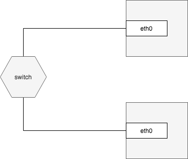

## Operating system in a networked environment

### Tasks


1. Using a virtual machine, install the OS and list the IP configuration parameters i.e:
   * Address
   * Netmask
   * Gateway address
   * DNS 1
   * DNS 2
    
   Obtain the above parameters on all of the following systems

   * [Linux Alpine](https://alpinelinux.org/)
   * [Linux Debian](https://www.debian.org/)
   * Windows 

2. Check and prepare the characteristics for a sample device in your home network
   * Address
   * Netmask
   * Gateway address
   * DNS 1
   * DNS 2
  
   Prepare graphic documentation of example home network, including addresses and devices

3. Register a CISCO Academy account to download Packet tracer 
   https://www.netacad.com/courses/packet-tracer


### Operating system characteristics

| Feature                   | value                 | comment                |
| -------------             |:-------------:        | -----:                    |
| name                      | linux                 | centos 7                  |
| interfaces configuration  | centos 7              | /etc/sysconfig/network-scripts         |
| ....                      | .....                 |                           |
| name                      | Alpine Linux          |                           |
| ip configuration          | ``$ ip all ``         | show all eth interfaces   | 
| Routing table             | ``$ ip route show ``  | what is gateway?!         | 
| check nameservers (DNS)   | ``$ cat /etc/resolv.conf ``  | which DNS were set | 

### Network connection details

| Parametr | wartość           | komentarzu |
| ------------- |:-------------:| -----:|
| Address      |         |  |
| Netmask|  |     |
| Gateway address         |         |  |
| DNS 1         |       |      |
| DNS 2         |          |    |

### Network diagram

in order to attach a picture 

```markdown


```



### Virtualization network types

Test the network parameters for the different types supported by your software. annotate each configuration with comments about functionality. 
* connection to internet Yes / No
* Connection to other virtual machines Yes / No
* Connection to host computer Yes / No
* connection to other devices on the Host's network Yes / No


-------------------------
| Application | Type | comment) |
| ------------- |:-------------:| -----:|
|Virtualbox|bridge||
|Virtualbox|hostonly||
|Virtualbox|nat||


### Other software that allows you to play with network configurations locally
#### Docker
https://docs.docker.com/network/#network-drivers

#### VMware
https://docs.vmware.com/en/VMware-Workstation-Player-for-Windows/16.0/com.vmware.player.win.using.doc/GUID-C82DCB68-2EFA-460A-A765-37225883337D.html


### Assignment

1. Register & log in to the Cisco Academy course.

   ``https://www.netacad.com/courses/packet-tracer``

2. 

   Download the Cisco Packet Tracer