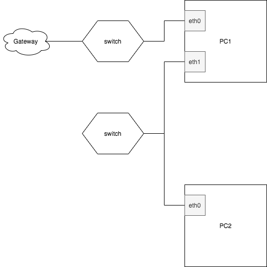

## Managing interfaces with the IP program

* interface status
    * interface up
    * interface down
* address
    * add address
    * change address
    * delete address
    * clean up addresses
* routing
    * get route for address
    
* physical address
    * show addresses of interfaces available on the network
    * show addresses for a specific interface
     

### ip 

| subcommand    |  polecenie   | opis  |
| ------------- |:-------------| :---------------| 
|   ``addr``    |                               | info about addressing and interface properties |
|               |   ``ip addr``                 | information on all interfaces              |
|               |   ``ip addr show dev enp0s3`` | information about a specific interface               |
|   ``link``    |                               |  |
|   ``route``   |  | |
|   ``maddr``   |  | |
|   ``neigh``   |  | |
|   ``help``    |  | |

### Task

1.
   * Prepare the network configuration as shown in the diagram above, 
   * Test the connection with ping command.
   * Test your connection to the Internet.
   * Check the route for connections with IP address from outside your local network e.g. 1.1.1.1.

1.1
   * Modify the network connections according to the diagram below.
   * Re-check the route for an address outside your local network.
  

2.
   * Install a ``HTTP`` server like ``nginx`` on the ``PC0`` computer. 
   * Configure the ``nginx`` program to display the contents of the `/var/www`` directory.
   * reload the configuration
   * Create a custom ``index.html`` file with text.
   * Test the communication with the ``localhost`` using the ``HTTP`` console client, the ``curl`` program.
3.
   * Check which port has been reserved for communication by the ``nginx`` progrmam.
   * such as the ``netstat`` program.

4.
   * Test the communication with the HTTP server from the ``PC2`` level.
   * is the curl command available?
   * e.g. ``curl {ip_address_pc_2}``.
   * Run a test for a connection on a port other than ``80``, e.g., ``curl {ip_address_pc_2}:8080``.
   * Is the answer analogous to the test from task ``2``?

5.
   * Expand the network with another ``PC3`` computer according to the diagram.
   

6. 
   * On the ``PC3`` computer create an index.html file in the ``/var/www`` directory.
   * On the ``PC3`` computer, start the ``HTTP`` protocol server, this time using python
   * ``python3 -m http.server --directory /var/www --bind 127.0.0.1``.
   * Move the program execution to the background ``ctrl + z`` ``bg``
   * Check the connection with ``curl localhost:port``
   * Check the connection with ``curl address_ip:port``.
   * Check the reserved ports with the ``netstat`` command.
   
7. 
    * On ``PC3``, modify the way you run the http server so that you can display the page from ``PC1`` and ``PC2``. 
    * Test this communication

8.
   * On ``PC0``, install and run in the background the ``chat-server`` program from Exercise 2.
   * Check the reserved ports with the ``netstat`` command.
   * On the ``PC1`` and ``PC2`` install the ``chat-client`` program.
   * Connect to the server at the IP address of the ``PC0``.

